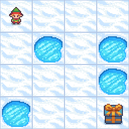

# Policy Gradient Method (Reinforce Algorithm)

This section introduces the **Policy Gradient** method as an alternative to the Deep Q-Learning (DQN) repository. While both methods aim to solve reinforcement learning tasks, they approach the problem differently. This implementation utilizes **policy-based reinforcement learning**, specifically a **policy gradient** approach, instead of the value-based method used in DQN.

## Policy Gradient Method:

- **Policy-Based Approach**: In contrast to estimating value functions, the policy gradient method directly optimizes the policy. The policy (a neural network) outputs probabilities for each action given a state, and actions are sampled from this distribution.
- **Stochastic Policy**: The agent samples actions from a probability distribution, allowing more exploration and flexibility, especially for environments where stochastic actions are needed.
- **Log-Probabilities & Rewards**: The agent's actions are chosen based on the probability distribution, and the log of the selected action's probability is stored. After the episode ends, the policy is updated by computing gradients using these log probabilities and the cumulative discounted rewards.
- **No Experience Replay**: Unlike DQN, there is no replay buffer. The policy is updated after every episode directly based on the rewards obtained in that episode.
- **Policy Optimization**: The focus is on optimizing the policy to maximize expected rewards by using gradient ascent on the log-probabilities of actions weighted by rewards.

## Overview of Policy Gradient Code

In this extension, the **Policy Gradient** method is implemented for the same `FrozenLake-v1` environment:

1. **Policy Network**:
   - The agent's policy is modeled using a neural network, which takes the current state (encoded as a one-hot vector) as input and outputs a probability distribution over the possible actions.
   - The network has one hidden layer with ReLU activation, followed by a softmax layer to ensure the output is a valid probability distribution.

2. **Action Selection**:
   - At each time step, an action is sampled from the probability distribution generated by the network. This allows the agent to explore different actions based on their probabilities.

3. **Log Probabilities**:
   - For each action taken, the log of the probability (`log_prob`) of that action is saved. These log probabilities are used later to update the policy.

4. **Rewards and Discounted Returns**:
   - The rewards obtained during each episode are recorded. For each time step, a **discounted return** is calculated, which is the sum of future rewards weighted by a discount factor `dr` (gamma). This helps the agent consider both immediate and long-term rewards.

5. **Policy Update**:
   - After the episode ends, the policy is updated using **policy gradient**. The loss is calculated by multiplying the log probability of each action by the corresponding discounted return. The network parameters are then updated to maximize the expected return using gradient ascent.

## Visualizations 
The following images demonstrate the training and testing phases of the REINFORCE algorithm:

- **Training Progress**: Shows how the agent learns to navigate the frozen lake over training episodes.
  - 

- **Testing Performance**: Shows how the agent performs after training for 500 episodes.
  - 
